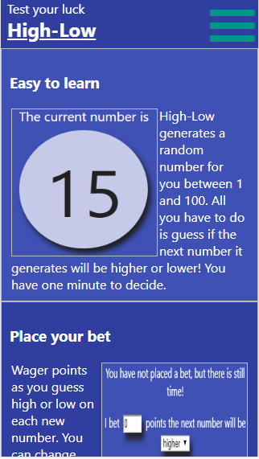
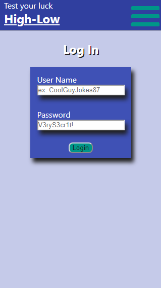
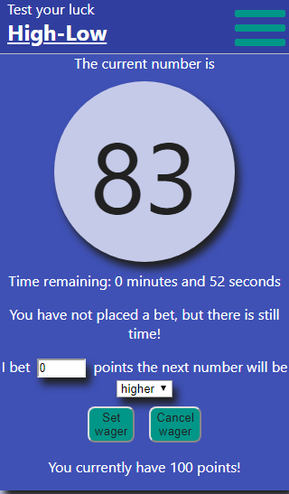

# High-Low

## Summary
High-Low is a lightweight game where users place wagers to earn points.  A randomly generated number between 1 and 100 inclusive are displayed and users bet on the next number being either higher or lower.  Successful wagers accrue points while points are deducted for incorrect guesses.  User are able to sign up for an account to save their progress between sessions.

## Live link
[https://high-low.now.sh/](https://high-low.now.sh/)

## Screenshots
Screenshots taken from the mobile client.

### Landing Page

### Login Page

### Game Page

### Account Page

## API documentation
### GET api/users

### POST api/users

### GET api/users/:user_id

### PATCH api/users/:user_id

### DELETE api/users/:user_id

## Technologies used
The front end of this project was built using React and styled with vanilla CSS.
The back end was built with Node and Express while the database uses Postgresql.  The database is connected to the API through the use of Knex.
This project was bootstrapped with [Create React App](https://github.com/facebook/create-react-app).